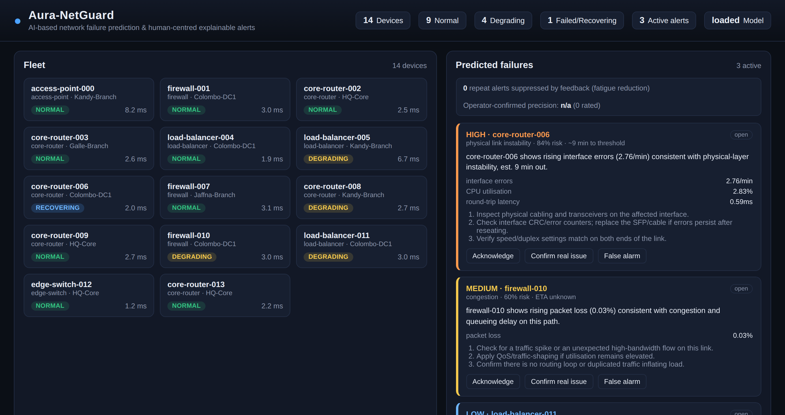
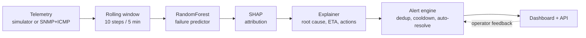

# Aura-NetGuard

**AI-Based Network Failure Prediction & Human-Centred Explainable Alert System**

A network monitoring prototype that forecasts device-level failures *before*
they happen — rather than firing once a threshold has already been breached —
and delivers each prediction as an alert a human will actually act on: a
plain-language root cause, an estimated time-to-failure, concrete remediation
steps, and a feedback loop that lets operators suppress repeat false alarms.

Built as an undergraduate research project. [`RESEARCH.md`](RESEARCH.md) is the
full write-up: problem statement, literature and gap analysis, novel
contributions, methodology, evaluation, and limitations.



## The idea in one paragraph

Two problems compound each other in network operations. Monitoring is
*reactive* — by the time an alert fires, users are already affected. And
operators suffer *alert fatigue* — alerts arrive without context, duplicate
endlessly for one underlying cause, and never explain themselves, so people
start ignoring them. Aura-NetGuard targets the intersection: predict the
failure early, then explain the prediction well enough to be trusted.

## What it does

- **Predicts, rather than detects.** Rolling-window features (last, mean, std,
  slope, delta, max across 9 metrics) feed a `RandomForestClassifier` trained
  to answer "will this device fail in the next ~7.5 minutes?" — not "is this
  device abnormal right now?"
- **Explains every prediction.** SHAP attribution identifies which metrics
  drove the score, mapped to an operator-relevant root cause (physical-layer
  instability, resource exhaustion, congestion, thermal) with an ETA and a
  remediation checklist.
- **Fights alert fatigue.** One alert per device+cause, updated in place
  rather than re-fired every tick; auto-resolution once risk subsides; and a
  cooldown that suppresses a cause an operator marked a false alarm — unless
  it escalates to CRITICAL, which always breaks through.
- **Learns from the operator.** Acknowledge / Confirm real issue / False alarm
  feedback is recorded, and the dashboard reports operator-confirmed precision
  alongside how many repeat alerts the feedback has suppressed.
- **Runs on real hardware or a simulator.** A built-in fault-injecting
  simulator needs no network access; an SNMP + ICMP collector polls real
  devices.

## How it works



## Quick start

```bash
python3 -m venv .venv && source .venv/bin/activate
pip install -r requirements.txt

python -m backend.app.ml.train        # train the model (~2 min)
uvicorn backend.app.main:app --reload
```

Open http://localhost:8000. The simulated fleet starts immediately and the
first predicted-failure alerts usually appear within a couple of minutes.

The trained model is not committed to the repository (it is a ~12 MB binary),
so the training step is required on a fresh clone. Without it the app still
runs and collects telemetry — it just does not predict.

## Results

Trained on a simulated fleet of 24 devices using a **device-level**
train/test split, so the figures reflect generalisation to devices never seen
during training — not merely unseen timestamps from devices already learned,
which overlapping rolling windows would leak across:

| Metric | Value |
|---|---|
| ROC-AUC (held-out devices) | 0.927 |
| PR-AUC (held-out devices) | 0.890 |
| Precision / recall (failure class) | 0.906 / 0.812 |
| Rows / positive rate | 94,313 / 17.7% |

**Alert volume reduction.** Across a 3,000-tick run over 10 devices, 2,350 raw
positive detections collapsed into 190 distinct alerts — roughly **12× fewer
notifications**, with no detection discarded (each alert carries its own
`detections_count`).

Regenerate with `python -m backend.app.ml.train`; the full report lands in
`backend/app/ml/model_store/training_report.json`.

## Connecting to a real network

The simulator sits behind a single `Collector` interface, so real telemetry
drops in without the model, explainer, alert engine, or dashboard changing:

```bash
pip install -r requirements-snmp.txt
cp config/devices.example.json config/devices.json   # then edit
export AURA_SNMP_COMMUNITY='your-read-only-community'
AURA_COLLECTOR=snmp uvicorn backend.app.main:app
```

**Read [`docs/real-data.md`](docs/real-data.md) before planning research around
this.** It covers the SNMP counter pitfalls that manufacture false alerts, why
the shipped model will not work on real telemetry as-is, and the labelling
problem that decides whether prediction is feasible on your network at all.

## Configuration

| Variable | Default | Purpose |
|---|---|---|
| `AURA_COLLECTOR` | `simulator` | `simulator` or `snmp` |
| `AURA_INVENTORY` | `config/devices.json` | Device list, when using SNMP |
| `AURA_SNMP_COMMUNITY` | — | Read-only community string (name it per device in the inventory) |

Model and alerting behaviour are tuned by constants rather than environment
variables:

| Constant | File | Meaning |
|---|---|---|
| `WINDOW_STEPS` | `features.py` | Feature window length (10 steps = 5 min) |
| `PREDICTION_HORIZON_STEPS` | `features.py` | How far ahead to predict (15 steps ≈ 7.5 min) |
| `SEVERITY_THRESHOLDS` | `alerts/models.py` | Probability → LOW/MEDIUM/HIGH/CRITICAL |
| `COOLDOWN_MINUTES` | `alerts/engine.py` | False-alarm suppression window |
| `AUTO_RESOLVE_STREAK` | `alerts/engine.py` | Quiet ticks before an alert auto-resolves |
| `CRITICAL_THRESHOLDS` | `alerts/explain.py` | Per-metric thresholds used for the ETA |
| `METRIC_RETENTION_HOURS` | `db.py` | Telemetry retention — **raise this before a long collection run** |

## API

| Endpoint | Purpose |
|---|---|
| `GET /api/devices` | Fleet with each device's latest reading |
| `GET /api/devices/{id}/metrics?limit=120` | Recent telemetry history |
| `GET /api/alerts?status=open` | Alerts, newest first |
| `POST /api/alerts/{id}/acknowledge` | Mark an alert as being worked |
| `POST /api/alerts/{id}/feedback` | `{"is_true_positive": true\|false}` |
| `GET /api/stats` | Fleet health, active alerts, suppression and precision counters |

## Tests

```bash
pytest        # 85 tests
```

Covering the simulator and fault injection, the feature pipeline, the
explanation layer, the alert engine (de-duplication, cooldown expiry,
auto-resolve, feedback), the API, and the collector — including SNMP counter
wrap-versus-reset handling and ping output parsing. The SNMP transport is
isolated behind a protocol so the collector is tested without hardware.

## Project layout

```
backend/app/
  simulator.py         synthetic telemetry generator + fault injection
  features.py          rolling-window features (shared by train and serve)
  ml/
    dataset.py         labelled dataset construction
    train.py           training + device-level evaluation
    predictor.py       model loading + SHAP explainability
  alerts/
    explain.py         SHAP -> root cause, summary, ETA, actions
    engine.py          severity, de-duplication, cooldown, feedback
    models.py          Alert model + severity thresholds
  collectors/
    base.py            Collector protocol + selection
    counters.py        SNMP counter -> rate, wrap/reset detection
    icmp.py            active latency/jitter/loss probing
    inventory.py       device inventory + OID profiles
    snmp.py            SNMP collector
  db.py                SQLite persistence
  state.py             in-process runtime state
  api/routes.py        REST API
  main.py              FastAPI app + background collection loop
frontend/              dashboard (vanilla HTML/CSS/JS + Chart.js)
backend/tests/         pytest suite
docs/real-data.md      real-network deployment guide
RESEARCH.md            research write-up
```

## Status and limitations

This is a research prototype, and the headline figures above deserve their
caveats stated plainly:

- **The results are from synthetic data.** The simulator generated both the
  training and the evaluation data, so the scores partly measure the model
  recovering the generator's own dynamics. Real telemetry should be expected
  to score lower. The numbers show the pipeline works and generalises across
  unseen simulated devices — they are not a claim about real-network accuracy.
- **The SNMP transport is unverified against physical hardware.** Everything
  above it is tested; the pysnmp layer itself has never met a real device.
- **Retraining on real data needs failure labels**, which a poller cannot
  produce. They must come from syslog, ticket history, or up/down records —
  and a well-run network may not contain enough failures to learn from.
- **The human-centred claims are mechanism-level.** The system demonstrably
  collapses alert volume; whether that reduces real operator fatigue needs the
  field study proposed in §7.4 of `RESEARCH.md`.
- **Three fault archetypes only.** Real networks also fail through routing
  instability, power loss, misconfiguration, and security incidents.

## Licence

MIT — see [`LICENSE`](LICENSE).
