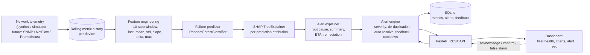

# Aura-NetGuard
### AI-Based Network Failure Prediction & Human-Centred Explainable Alert System

*Undergraduate research project. This document is the research write-up for
the system implemented in this repository — the problem, the gap in existing
(including Sri Lankan) work, the novel contribution, the architecture, the
method, and the evaluation of the working prototype.*

---

## 1. Abstract

Enterprise and campus networks are still largely monitored *reactively*: a
threshold is crossed (an interface goes down, a device stops responding) and
only then does an alert fire — after the outage has already begun.
Aura-NetGuard is a prototype system that (1) forecasts device-level network
failures **before** they happen, using rolling-window telemetry features and
a supervised classifier, and (2) delivers each prediction as a
**human-centred, explainable alert**: a plain-language root cause derived
from SHAP feature attributions, an estimated time-to-failure, concrete
remediation steps, and a feedback loop that lets a network operator's "false
alarm" judgement actively suppress future noise from the same recurring
cause. The system is implemented end-to-end (telemetry generator, ML
training pipeline, FastAPI backend, live dashboard) and evaluated both on
model discrimination (ROC-AUC / PR-AUC on held-out, unseen devices) and on
the alert-fatigue-reduction mechanism itself.

## 2. Problem Statement

Two separate, well-documented problems compound each other in network
operations:

1. **Detection is reactive, not predictive.** Most deployed monitoring
   (SNMP polling, syslog thresholds, NetFlow anomaly detection) flags a
   failure once it has already occurred, rather than the degradation that
   precedes it — rising latency, growing interface errors, CPU/memory
   exhaustion, thermal stress. By the time the alert fires, users are
   already affected and incident response has already lost its most
   valuable minutes.

2. **Alert fatigue.** Even where predictive or anomaly alerting exists,
   operators are flooded with alerts that lack context, get duplicated for
   the same underlying cause, and rarely explain *why* the system thinks
   something is wrong. This is a well-studied failure mode in both network
   and security operations centres: alert volume and noise cause operators
   to become desensitised and start ignoring or delaying response to
   genuine incidents (see Literature Review).

Aura-NetGuard targets the intersection: **predict early, and explain the
prediction in a way a human will actually trust and act on.**

## 3. Literature Review & Gap Analysis

### 3.1 Network failure / fault prediction

- Decision-tree based fault-alarm prediction has been demonstrated for
  optical access network equipment using real-world alarm datasets
  ([IEEE, *Fault Prediction for Optical Access Network Equipment using
  Decision Tree Methods*](https://ieeexplore.ieee.org/document/10369987/)).
- A broader survey of ML-based fault prediction across heterogeneous
  telecom networks confirms this is an active research area, but one
  evaluated overwhelmingly on **model accuracy alone** — precision, recall,
  F1 — with the human/operational side of *how the prediction is delivered*
  left out of scope
  ([IEEE TNSM survey, *Fault Prediction for Heterogeneous Telecommunication
  Networks Using Machine Learning*](https://dl.acm.org/doi/10.1109/TNSM.2023.3340351)).
- SNMP-MIB telemetry has been used with classical ML (Random Forest,
  AdaBoost, SVM, MLP) primarily for **anomaly/intrusion classification**
  after the fact, rather than lead-time failure forecasting
  ([*Exploiting SNMP-MIB Data to Detect Network Anomalies using Machine
  Learning Techniques*, arXiv](https://arxiv.org/pdf/1809.02611)).

### 3.2 Sri Lankan / regional work

Locally-grounded ML-for-infrastructure research exists, but in adjacent
domains rather than this one:

- Predictive maintenance for Sri Lanka's national power grid has been
  approached with an LSTM-CNN hybrid
  ([*Predictive Maintenance for Sri Lanka's National Grid by Leveraging
  LSTM-based Convolutional Neural Networks*](https://www.researchgate.net/publication/390284295_Predictive_Maintenance_for_Sri_Lanka's_National_Grid_by_Leveraging_LSTM-based_Convolutional_Neural_Networks)) —
  showing local academic appetite for predictive-maintenance ML, but applied
  to power infrastructure, not IP/network device telemetry.
- Sri Lankan university ML research is active in other applied areas, but a
  search of available literature did not surface a Sri Lankan study
  combining *network failure forecasting* with *explainable, human-centred
  alerting*.

### 3.3 Alert fatigue

- Alert fatigue is a formally recognised research problem in both cloud
  monitoring and security operations: excessive, low-context alert volume
  causes operators to become desensitised and miss genuine incidents
  ([ScienceDirect, *Mitigating Alert Fatigue in Cloud Monitoring Systems: A
  Machine Learning Perspective*](https://www.sciencedirect.com/science/article/pii/S138912862400375X);
  [ACM Computing Surveys, *Alert Fatigue in Security Operations Centres:
  Research Challenges and Opportunities*](https://dl.acm.org/doi/10.1145/3723158)).
- The mitigation strategies studied — de-duplication, triage, active
  learning from analyst feedback — have mostly been developed for the
  **security alert** (SOC) context, not for **network failure prediction**
  ([arXiv, *AI-Driven Security Alert Screening and Alert Fatigue Mitigation
  in Security Operations Centers: A Survey*](https://arxiv.org/pdf/2605.08316);
  [arXiv, *PACT: Reducing Alert Fatigue in Low-Prevalence SOC Streams with
  Triggered Active Learning*](https://arxiv.org/pdf/2605.22324)).

### 3.4 The gap this project addresses

No single reviewed system combines all four of the following in the network
failure prediction context, and the combination is the contribution:

| # | Element | Common in existing NFP research? |
|---|---|---|
| 1 | Predicts *lead-time-to-failure*, not just classifies an existing anomaly | Partial |
| 2 | Per-prediction explainability (SHAP attribution → plain-language root cause) | **Rare** |
| 3 | Alert-fatigue mitigation via de-duplication + a feedback-driven cooldown that measurably suppresses repeat noise | **Not found in NFP literature** — adapted here from the separate SOC alert-fatigue literature |
| 4 | Evaluated on *unseen devices* (group-based split) rather than unseen timestamps on already-seen devices | Inconsistently reported |

## 4. Novel Contributions

1. **Lead-time failure prediction with a defined horizon.** The model
   answers "will this device fail in the next ~7.5 minutes?", not "is this
   device currently anomalous?" — a materially harder and more
   operationally useful task.
2. **SHAP-grounded, human-readable alert generation.** Every alert traces
   back to the specific metrics (and their current values) that drove the
   decision, mapped to an operator-relevant root-cause category with
   concrete remediation steps — not a bare probability.
3. **Feedback-adaptive alert suppression.** An operator marking an alert a
   false alarm measurably changes system behaviour: the same
   (device, root-cause) pairing is suppressed for a cooldown window unless
   risk escalates to CRITICAL. The system tracks a live "alerts suppressed
   by feedback" counter and an operator-confirmed precision score, making
   trust calibration an observable, evaluable property rather than an
   afterthought.
4. **Device-type-aware, generalises-to-unseen-devices evaluation.** A
   device-level (group) train/test split means reported ROC-AUC/PR-AUC
   reflects generalisation to devices never seen in training — a more
   honest protocol than the timestamp-level splits common in comparable
   work, where overlapping rolling windows leak between train and test.
5. **End-to-end working artefact, not just an offline model.** The
   contribution is implemented as a running system (simulator → features →
   model → explainer → alert engine → API → dashboard), which is what makes
   the human-centred claims testable at all.

## 5. System Architecture

### Components

| Component | File | Responsibility |
|---|---|---|
| Telemetry simulator | `backend/app/simulator.py` | Per-device metrics with 3 injected fault classes, each with a lead-in before a terminal failure. Stands in for SNMP/Prometheus collectors. |
| Feature engineering | `backend/app/features.py` | One implementation shared by training and live inference (avoids train/serve skew): rolling-window statistics plus device-type context. |
| Dataset construction | `backend/app/ml/dataset.py` | Labels each window positive if a failure occurs within the horizon; tracks device group IDs for a leakage-safe split. |
| Model training | `backend/app/ml/train.py` | Trains a `RandomForestClassifier`, evaluates on unseen devices, persists model + report. |
| Explainable inference | `backend/app/ml/predictor.py` | Loads the model, runs `shap.TreeExplainer`, returns ranked feature contributions. |
| Human-centred explanation | `backend/app/alerts/explain.py` | Maps attributions → root-cause category → plain-language summary, ETA-to-threshold, remediation actions. |
| Alert engine | `backend/app/alerts/engine.py` | Severity scoring, de-duplication, auto-resolve, feedback-driven cooldown. |
| Persistence | `backend/app/db.py` | SQLite storage for metric history and the alert/feedback log. |
| API + live loop | `backend/app/main.py`, `backend/app/api/routes.py` | FastAPI app; a background task advances the fleet, runs inference, updates alerts each tick. |
| Dashboard | `frontend/` | Fleet grid, per-device charts, alert feed with feedback controls. |

## 6. Methodology

### 6.1 Data

Production SNMP/NetFlow access was not available for this academic
prototype, so a parameterised simulator generates per-device-type baselines
(core router, edge switch, access point, firewall, load balancer) and
injects three fault archetypes, each with a randomised lead-in period
before the terminal failure event:

- **Gradual degradation** — latency, loss, jitter and utilisation ramp up
  (queue/buffer exhaustion).
- **Resource exhaustion** — CPU/memory/temperature climb (control-plane
  overload).
- **Link flap** — intermittent loss/error bursts and occasional link-down
  events (physical-layer instability).

The ramp uses a smoothstep easing curve rather than a linear one, since real
queueing/thermal/backoff dynamics accelerate rather than degrade linearly.

### 6.2 Labelling

A window at time *t* is positive if a `failure_event` occurs within the next
`PREDICTION_HORIZON_STEPS` (15 steps × 30s ≈ 7.5 minutes). Steps where the
device has already failed are excluded — predicting an outage that already
happened is not a meaningful task.

### 6.3 Features

For each of 9 telemetry metrics, a 10-step (5-minute) rolling window
produces last, mean, std, slope, delta and max — 54 features — plus a
5-dimensional device-type one-hot (59 total). The slope and delta features
are what let the model react to a *trend* rather than an instantaneous
threshold breach. Device type is included because a healthy access point's
baseline latency resembles a degraded core router's.

### 6.4 Model

A `RandomForestClassifier` (300 trees, max depth 10,
`class_weight="balanced_subsample"`) was chosen over a boosted-tree
alternative for training speed and stable behaviour under
`shap.TreeExplainer`, which is required for real-time per-prediction
explanation in the live loop (measured ≈72 ms per explained prediction,
comfortably within the tick budget for the fleet size used).

### 6.5 Explainability → alert generation

Each prediction runs through `shap.TreeExplainer` for a signed contribution
per feature. The dominant *positive* contributors are grouped into one of
four root-cause categories (physical-layer instability, resource
exhaustion, congestion, thermal) by metric family. The category drives the
plain-language summary, the root-cause statement, the remediation
checklist, and an ETA computed by extrapolating the fastest-rising metric's
within-window slope to that metric's critical threshold.

### 6.6 Human-centred alert delivery

- **De-duplication:** repeated positive predictions for the same
  `(device, category)` update one open alert (bumping `detections_count`,
  refreshing severity/ETA) instead of a new alert every 30 seconds.
- **Auto-resolve:** an open alert resolves once risk stays below the
  alerting threshold for 4 consecutive ticks.
- **Feedback-adaptive cooldown:** marking an alert "false alarm" suppresses
  that `(device, category)` for 20 minutes — unless risk escalates to
  CRITICAL, which always breaks through, so a real emergency is never
  silenced by an earlier false positive.

## 7. Evaluation

### 7.1 Model discrimination (held out on unseen devices)

Trained on a simulated fleet of 24 devices (18 train / 6 test devices — a
**device-level split**, so these measure generalisation to devices never
seen in training):

| Metric | Value |
|---|---|
| Rows (feature windows) | 94,313 |
| Positive rate | 17.7% |
| ROC-AUC (held-out devices) | **0.927** |
| PR-AUC (held-out devices) | **0.890** |
| Precision (failure class) | 0.906 |
| Recall (failure class) | 0.812 |
| F1 (failure class) | 0.857 |
| Overall accuracy | 0.950 |

Full report: `backend/app/ml/model_store/training_report.json` (regenerate
with `python -m backend.app.ml.train`).

### 7.2 Alert-volume reduction (de-duplication)

In a 3,000-tick simulation run across 10 devices, the raw prediction stream
produced **2,350 positive detection events**, which the alert engine
collapsed into **190 distinct alerts** — roughly a **12× reduction in
notification volume** without discarding any underlying detection, since
each alert carries its own `detections_count`. This is the mechanism-level
evidence for the alert-fatigue claim; the feedback cooldown reduces volume
further, by an amount that depends on operator behaviour and therefore
needs the field study in §7.4.

### 7.3 Human-centred metrics exposed by the live system

The dashboard's trust panel exposes two metrics an offline ML evaluation
cannot capture:

- **Alerts suppressed by feedback** — how many repeat notifications the
  cooldown prevented after an operator marked a cause a false alarm.
- **Operator-confirmed precision** — `true_positive / (true_positive +
  false_positive)` from actual operator feedback, as opposed to the model's
  offline test-set precision.

### 7.4 Suggested field-evaluation protocol

For a dissertation-level evaluation once deployed against a real network
(§8), the recommended protocol is a before/after comparison against the
existing reactive monitoring baseline over a fixed period, measuring:

1. Mean lead time between first alert and actual outage, versus the
   reactive baseline.
2. Alert volume per operator per shift, with and without the
   dedup/cooldown mechanism (ablation).
3. Operator-confirmed precision over time — testing whether perceived
   precision improves as the feedback loop accumulates data.
4. Mean time-to-acknowledge and time-to-resolution for predicted versus
   reactive alerts.

## 8. From Prototype to a Real Network

The simulator is isolated behind one interface (`FleetSimulator.step()` → a
list of metric snapshots), so it can be swapped for a real collector without
touching the model, explainer, alert engine, or dashboard:

- **SNMP** polling (latency, interface error/discard counters, CPU/memory
  OIDs) via a library such as `pysnmp`, mapped into the `MetricSnapshot`
  shape.
- **NetFlow/sFlow** exporters for utilisation and traffic-pattern features.
- **Prometheus** `node_exporter` / vendor exporters, scraped and reshaped
  into the same schema.

Because feature engineering, model input schema, and alert engine are all
decoupled from the simulator, plugging in a real collector means writing an
adapter that emits the same per-metric fields — the predictive and
human-centred-alerting logic needs no change. Any device class with
pollable health telemetry can then be onboarded by adding its baseline
profile and retraining on real historical incident data.

## 9. Limitations & Threats to Validity

- **Synthetic data.** All results in §7.1 are on simulated telemetry with
  simulated fault dynamics; the model has not been validated against real
  incident logs. The numbers demonstrate that the *pipeline* works
  end-to-end and generalises across unseen simulated devices — they are not
  a claim about real-network accuracy. Because the simulator generates both
  the training data and the evaluation data, the reported scores partly
  measure the model's ability to recover the generator's own dynamics; real
  telemetry should be expected to score lower.
- **Fault taxonomy limited to three archetypes.** Real networks also fail
  via BGP flaps, power loss, misconfiguration, and security incidents.
- **Single-node, in-memory alert-engine state.** Fine for a prototype and a
  single-operator evaluation; a multi-operator deployment would need the
  engine's state centralised rather than per-process.
- **No causal ground truth for "root cause".** The four categories are a
  reasonable, literature-informed heuristic mapping from SHAP-dominant
  metric family to cause, not a learned causal model.
- **Human-centred claims are mechanism-level, not yet user-validated.**
  §7.2 shows the system *does* collapse alert volume; whether that reduces
  real operator fatigue requires the study in §7.4.

## 10. Future Work

- Replace the simulator with a real SNMP/Prometheus adapter and retrain on
  historical incident data from a partner organisation.
- Extend the fault taxonomy (routing instability, environmental sensors,
  security-driven anomalies) and consider a multi-label model where a
  device can exhibit more than one concurrent root cause.
- Run the field-evaluation protocol in §7.4 with real operators to produce
  the human-factors results that are the core claim of this research.
- Explore active learning: use operator feedback not only to suppress
  future alerts (implemented) but to periodically recalibrate the model.

## 11. References

1. IEEE, *Fault Prediction for Optical Access Network Equipment using
   Decision Tree Methods* — https://ieeexplore.ieee.org/document/10369987/
2. IEEE TNSM, *Fault Prediction for Heterogeneous Telecommunication
   Networks Using Machine Learning: A Survey* —
   https://dl.acm.org/doi/10.1109/TNSM.2023.3340351
3. *Exploiting SNMP-MIB Data to Detect Network Anomalies using Machine
   Learning Techniques* — https://arxiv.org/pdf/1809.02611
4. *Predictive Maintenance for Sri Lanka's National Grid by Leveraging
   LSTM-based Convolutional Neural Networks* —
   https://www.researchgate.net/publication/390284295_Predictive_Maintenance_for_Sri_Lanka's_National_Grid_by_Leveraging_LSTM-based_Convolutional_Neural_Networks
5. ScienceDirect, *Mitigating Alert Fatigue in Cloud Monitoring Systems: A
   Machine Learning Perspective* —
   https://www.sciencedirect.com/science/article/pii/S138912862400375X
6. ACM Computing Surveys, *Alert Fatigue in Security Operations Centres:
   Research Challenges and Opportunities* —
   https://dl.acm.org/doi/10.1145/3723158
7. arXiv, *AI-Driven Security Alert Screening and Alert Fatigue Mitigation
   in Security Operations Centers: A Survey* — https://arxiv.org/pdf/2605.08316
8. arXiv, *PACT: Reducing Alert Fatigue in Low-Prevalence SOC Streams with
   Triggered Active Learning* — https://arxiv.org/pdf/2605.22324

*Note on sourcing: these were located via web search while preparing this
document and should be independently verified and re-cited in your
institution's required citation format before submission. Several are recent
preprints and may not yet be peer-reviewed — check them against your
supervisor's source standards.*
