# Aura-NetGuard
### AI-Based Network Failure Prediction & Human-Centred Explainable Alert System

*Undergraduate research project. This document is the research write-up for the
system implemented in this repository — it describes the problem, the gap in
existing (including Sri Lankan) work, the novel contribution, the architecture,
the method, and the evaluation of the working prototype.*

---

## 1. Abstract

Enterprise and campus networks are still largely monitored *reactively*: a
threshold is crossed (an interface goes down, a device stops responding) and
only then does an alert fire — after the outage has already begun. Aura-NetGuard
is a prototype system that (1) forecasts device-level network failures **before**
they happen, using rolling-window telemetry features and a supervised
classifier, and (2) delivers each prediction as a **human-centred, explainable
alert**: a plain-language root cause derived from SHAP feature attributions, an
estimated time-to-failure, concrete remediation steps, and a feedback loop that
lets a network operator's "false alarm" judgement actively suppress future
noise from the same recurring cause. The system is implemented end-to-end
(synthetic telemetry generator, ML training pipeline, FastAPI backend, live
dashboard) and evaluated both on model discrimination (ROC-AUC / PR-AUC on
held-out, unseen devices) and on the alert-fatigue-reduction mechanism itself.

## 2. Problem Statement

Two separate, well-documented problems compound each other in network
operations:

1. **Detection is reactive, not predictive.** Most deployed monitoring
   (SNMP polling, syslog thresholds, NetFlow anomaly detection) flags a
   failure once it has already occurred, rather than the degradation that
   precedes it (rising latency, growing interface errors, CPU/memory
   exhaustion, thermal stress). By the time the alert fires, users are
   already affected and the incident-response clock has already lost its
   most valuable minutes.

2. **Alert fatigue.** Even where predictive/anomaly alerting exists,
   operators are flooded with alerts that lack context, get duplicated for
   the same underlying cause, and rarely explain *why* the system thinks
   something is wrong. This is a well-studied failure mode in both network
   operations centres and security operations centres: alert volume and
   noise cause operators to become desensitised and start ignoring or
   delaying response to genuine incidents (see Literature Review).

Aura-NetGuard targets the intersection of these two problems: **predict
early, and explain the prediction in a way a human will actually trust and
act on.**

## 3. Literature Review & Gap Analysis

### 3.1 Network failure / fault prediction

- Decision-tree based fault-alarm prediction has been demonstrated for
  optical access network equipment using real-world alarm datasets
  ([IEEE, *Fault Prediction for Optical Access Network Equipment using
  Decision Tree Methods*](https://ieeexplore.ieee.org/document/10369987/)).
- A broader survey of ML-based fault prediction across heterogeneous
  telecom networks confirms this is an active research area, but one that
  is overwhelmingly evaluated on **model accuracy alone** — precision,
  recall, F1 — with the human/operational side of *how the prediction is
  delivered* left out of scope
  ([IEEE TNSM survey, *Fault Prediction for Heterogeneous Telecommunication
  Networks Using Machine Learning*](https://dl.acm.org/doi/10.1109/TNSM.2023.3340351)).
- SNMP-MIB telemetry has been used with classical ML (Random Forest,
  AdaBoost, SVM, MLP) primarily for **anomaly/intrusion classification**
  after the fact, rather than lead-time failure forecasting
  ([*Exploiting SNMP-MIB Data to Detect Network Anomalies using Machine
  Learning Techniques*, arXiv](https://arxiv.org/pdf/1809.02611)).

### 3.2 Sri Lankan / regional work

Locally-grounded ML-for-infrastructure research exists but sits in adjacent
domains rather than this one:

- Predictive maintenance for Sri Lanka's national power grid has been
  approached with an LSTM-CNN hybrid
  ([ResearchGate, *Predictive Maintenance for Sri Lanka's National Grid by
  Leveraging LSTM-based Convolutional Neural Networks*](https://www.researchgate.net/publication/390284295_Predictive_Maintenance_for_Sri_Lanka's_National_Grid_by_Leveraging_LSTM-based_Convolutional_Neural_Networks)) —
  demonstrating local academic appetite for predictive-maintenance ML, but
  applied to power infrastructure, not IP/network device telemetry.
- Sri Lankan university ML research output (e.g. SLIIT) is active in other
  applied-ML areas (for example student-outcome prediction), but a search
  of the available literature did not surface a Sri Lankan study combining
  *network failure forecasting* with *explainable, human-centred alerting*.

### 3.3 Alert fatigue

- Alert fatigue is a formally recognised research problem in both cloud
  monitoring and security operations: excessive, low-context alert volume
  causes operators to become desensitised and miss genuine incidents
  ([ScienceDirect, *Mitigating Alert Fatigue in Cloud Monitoring Systems: A
  Machine Learning Perspective*](https://www.sciencedirect.com/science/article/pii/S138912862400375X);
  [ACM Computing Surveys, *Alert Fatigue in Security Operations Centres:
  Research Challenges and Opportunities*](https://dl.acm.org/doi/10.1145/3723158)).
- The mitigation strategies studied for this problem — de-duplication,
  triage, active learning from analyst feedback — have mostly been
  developed for the **security alert** context (SOC), not for **network
  failure prediction** specifically
  ([arXiv, *AI-Driven Security Alert Screening and Alert Fatigue Mitigation
  in Security Operations Centers: A Survey*](https://arxiv.org/pdf/2605.08316);
  [arXiv, *PACT: Reducing Alert Fatigue in Low-Prevalence SOC Streams with
  Triggered Active Learning*](https://arxiv.org/pdf/2605.22324)).

### 3.4 The gap this project addresses

No single reviewed system combines all four of the following in the network
failure prediction context, and the combination is what this project
contributes:

| # | Element | Common in existing NFP research? |
|---|---|---|
| 1 | Predicts *lead-time-to-failure*, not just classifies an existing anomaly | Partial |
| 2 | Per-prediction explainability (SHAP feature attribution → plain-language root cause) | **Rare** |
| 3 | Alert-fatigue mitigation via de-duplication + a feedback-driven cooldown that measurably suppresses repeat noise | **Not found in NFP literature** — borrowed here from the separate SOC alert-fatigue literature and adapted |
| 4 | Evaluated on *unseen devices* (group-based train/test split) rather than unseen timestamps on already-seen devices, avoiding a common source of inflated reported accuracy | Inconsistently reported |

## 4. Novel Contributions

1. **Lead-time failure prediction with a defined prediction horizon.**
   The model is trained to answer "will this device fail in the next
   ~7.5 minutes?", not "is this device currently anomalous?" — a
   materially harder and more operationally useful task.
2. **SHAP-grounded, human-readable alert generation.** Every alert traces
   back to the specific metrics (and their current values) that drove the
   model's decision, mapped to an operator-relevant root-cause category
   (physical-layer instability, resource exhaustion, congestion, thermal)
   with concrete remediation steps — not a bare probability.
3. **Feedback-adaptive alert suppression.** An operator marking an alert as
   a false alarm measurably changes system behaviour: the same
   (device, root-cause) pairing is suppressed for a cooldown window unless
   risk escalates to CRITICAL. The system tracks and reports a live
   "alerts suppressed by feedback" counter and an operator-confirmed
   precision score, making trust calibration an observable, evaluable
   property of the system rather than an afterthought.
4. **Device-type-aware, generalises-to-unseen-devices evaluation.** Model
   evaluation uses a device-level (group) train/test split, so the reported
   ROC-AUC/PR-AUC reflects generalisation to devices never seen during
   training — a more honest evaluation protocol than the timestamp-level
   splits common in comparable work.
5. **End-to-end working artefact, not just an offline model.** The
   contribution is implemented as a running system (simulator → feature
   pipeline → model → explainer → alert engine → API → live dashboard),
   which is what makes the human-centred claims (dedup, cooldown, feedback
   loop) testable at all.

## 5. System Architecture

```mermaid
flowchart LR
    subgraph Telemetry
        SIM["Network Telemetry\n(synthetic simulator / future: SNMP, NetFlow, Prometheus)"]
    end

    SIM --> HIST[("Rolling metric history\nper device (in-memory + SQLite)")]
    HIST --> FEAT["Feature engineering\n(10-step rolling window:\nlast, mean, std, slope, delta, max)"]
    FEAT --> MODEL["Failure Predictor\n(RandomForestClassifier)"]
    MODEL --> SHAP["SHAP TreeExplainer\n(per-prediction feature attribution)"]
    SHAP --> EXPLAIN["Alert Explainer\n(root-cause category,\nplain-language summary,\nETA, remediation steps)"]
    EXPLAIN --> ENGINE["Alert Engine\n(severity scoring,\nde-duplication,\nauto-resolve,\nfeedback cooldown)"]
    ENGINE --> DB[("SQLite: alerts +\nfeedback log")]
    ENGINE --> API["FastAPI REST API"]
    API --> UI["Dashboard\n(fleet health, live charts,\nalert feed, feedback controls)"]
    UI -->|acknowledge / confirm / false alarm| API
    API --> ENGINE
```

### Components

| Component | File(s) | Responsibility |
|---|---|---|
| Telemetry simulator | `backend/app/simulator.py` | Generates realistic per-device metrics and injects 3 fault classes (gradual degradation, resource exhaustion, link flap) with a lead-in period before a terminal failure event. Stands in for SNMP/Prometheus/NetFlow collectors in a real deployment. |
| Feature engineering | `backend/app/features.py` | Single shared implementation used for both training and live inference (avoids train/serve skew), producing rolling-window statistics per metric plus device-type context. |
| Dataset construction | `backend/app/ml/dataset.py` | Labels each window as positive if a failure occurs within the next `PREDICTION_HORIZON_STEPS`; tracks device group IDs for a leakage-safe split. |
| Model training | `backend/app/ml/train.py` | Trains a `RandomForestClassifier`, evaluates on **unseen devices**, persists the model + a training report. |
| Explainable inference | `backend/app/ml/predictor.py` | Loads the model, runs `shap.TreeExplainer` per prediction, returns ranked feature contributions. |
| Human-centred explanation | `backend/app/alerts/explain.py` | Maps feature attributions → root-cause category → plain-language summary, ETA-to-threshold (via trend extrapolation), and remediation actions. |
| Alert engine | `backend/app/alerts/engine.py` | Severity scoring, de-duplication (one alert per device+cause, updated in place), auto-resolve on sustained low risk, and feedback-driven cooldown suppression. |
| Persistence | `backend/app/db.py` | SQLite storage for metric history and the alert/feedback log. |
| API + live loop | `backend/app/main.py`, `backend/app/api/routes.py` | FastAPI app; a background task advances the simulated fleet clock, runs inference, and updates alerts every tick. |
| Dashboard | `frontend/` | Fleet health grid, per-device metric charts, and an alert feed with acknowledge / "confirm real issue" / "false alarm" controls. |

## 6. Methodology

### 6.1 Data

Real production SNMP/NetFlow access to a company network was not available
for this academic prototype, so a statistically-parameterised simulator
(`backend/app/simulator.py`) generates per-device-type baselines (core
router, edge switch, access point, firewall, load balancer) and injects
three fault archetypes, each with a randomised lead-in period before the
terminal failure event:

- **Gradual degradation** — latency, loss, jitter and utilisation ramp up
  (e.g. queue/buffer exhaustion).
- **Resource exhaustion** — CPU/memory/temperature climb (control-plane
  overload).
- **Link flap** — intermittent loss/error bursts and occasional link-down
  events (physical-layer instability).

The ramp uses a smoothstep easing curve rather than a linear one, since real
queueing/thermal/backoff dynamics accelerate rather than degrade linearly.

### 6.2 Labelling

A window at time *t* is labelled positive if a `failure_event` occurs
anywhere in the next `PREDICTION_HORIZON_STEPS` (15 steps × 30s ≈ 7.5
minutes). Steps where the device has already failed are excluded from
training, since predicting an outage that has already happened is not a
meaningful task.

### 6.3 Features

For each of 9 telemetry metrics, a 10-step (5-minute) rolling window
produces: last value, mean, standard deviation, linear-regression slope,
delta (last − first), and max — 54 features, plus a 5-dimensional device-type
one-hot (59 features total). The slope and delta features are what let the
model react to a *trend*, not just an instantaneous threshold breach.

### 6.4 Model

A `RandomForestClassifier` (300 trees, max depth 10, `class_weight =
"balanced_subsample"`) was selected over a boosted-tree alternative for
training speed and stable behaviour under `shap.TreeExplainer`, which is
required for real-time, per-prediction explanation generation in the live
loop.

### 6.5 Explainability → Alert Generation

Each prediction runs through `shap.TreeExplainer` to get a signed
contribution per feature. The dominant *positive* contributors are grouped
into one of four root-cause categories (physical-layer instability,
resource exhaustion, congestion, thermal) by which underlying metric family
they belong to. The category drives: the plain-language summary sentence,
the root-cause statement, the recommended remediation checklist, and an
ETA-to-threshold computed by extrapolating the dominant metric's
within-window slope to a defined critical threshold for that metric.

### 6.6 Human-Centred Alert Delivery

- **De-duplication:** repeated positive predictions for the same
  `(device, root_cause_category)` update one open alert (bumping a
  `detections_count`, refreshing severity/ETA) instead of spamming a new
  alert every 30 seconds.
- **Auto-resolve:** an open alert resolves automatically once risk stays
  below the alerting threshold for 4 consecutive ticks.
- **Feedback-adaptive cooldown:** an operator marking an alert "false
  alarm" suppresses that exact `(device, category)` pairing for 20 minutes
  unless the risk escalates to CRITICAL (which always breaks through the
  cooldown, so a real emergency is never silenced by a prior false
  positive).

## 7. Evaluation

### 7.1 Model discrimination (held out on unseen devices)

Trained on a simulated fleet of 24 devices (18 devices/train, 6
devices/test — a **device-level split**, so these numbers measure
generalisation to devices the model never saw during training):

| Metric | Value |
|---|---|
| Rows (feature windows) | 94,313 |
| Positive rate | 17.7% |
| ROC-AUC (held-out devices) | **0.927** |
| PR-AUC (held-out devices) | **0.890** |
| Precision (failure class) | 0.906 |
| Recall (failure class) | 0.812 |
| F1 (failure class) | 0.857 |
| Overall accuracy | 0.950 |

Full report: `backend/app/ml/model_store/training_report.json` (regenerate
with `python -m backend.app.ml.train`).

### 7.2 Human-centred metrics (from the live system, not the offline model)

The dashboard's "Trust & Alert Quality" panel exposes two metrics that a
purely offline ML evaluation does not capture:

- **Alerts suppressed by feedback** — a direct count of how many repeat
  notifications the cooldown mechanism prevented after an operator marked
  a cause as a false alarm, i.e. a measurable alert-fatigue reduction.
- **Operator-confirmed precision** — `true_positive / (true_positive +
  false_positive)` computed from actual operator feedback on alerts, as
  opposed to the model's offline test-set precision. This is the metric
  that should be tracked in a longer field evaluation (see §9).

### 7.3 Suggested field-evaluation protocol (for the campus/company study)

For a full dissertation-level evaluation once deployed against a real
network (see §8), the recommended protocol is a **before/after comparison
against the existing reactive monitoring baseline** over a fixed period, on:

1. Mean lead time between first alert and actual outage (Aura-NetGuard vs.
   the reactive baseline that currently exists).
2. Alert volume per operator per shift, with and without the dedup/cooldown
   mechanism enabled (ablation).
3. Operator-confirmed precision over time — testing the hypothesis that
   precision, as perceived by operators, improves as the feedback loop
   accumulates data.
4. Mean time-to-acknowledge and mean time-to-resolution for predicted vs.
   reactive alerts.

## 8. From Prototype to a Real Company Network

The simulator is intentionally isolated behind one interface
(`FleetSimulator.step()` → a list of metric snapshots) so it can be swapped
for a real collector without touching the model, explainer, alert engine, or
dashboard:

- **SNMP** polling (`latency`, interface error/discard counters, CPU/memory
  OIDs) via a library such as `pysnmp`, mapped into the same
  `MetricSnapshot` shape.
- **NetFlow/sFlow** exporters for utilisation/traffic-pattern features.
- **Prometheus** `node_exporter` / vendor exporters, scraped and reshaped
  into the same schema.

Because the feature engineering, model input schema, and alert engine are
all decoupled from the simulator, plugging in a real collector is a matter
of writing a new adapter that emits the same per-metric fields — the
predictive and human-centred-alerting logic this project contributes
requires no change. This is what makes the system usable for **fixing
whatever network-side problem shows up on a company's infrastructure**: any
device class with pollable health telemetry can be onboarded by adding its
baseline to `DeviceSimulator.BASELINES`-equivalent config and retraining (or
incrementally fine-tuning) on real historical incident data once available.

## 9. Limitations & Threats to Validity

- **Synthetic data.** All results in §7.1 are on simulated telemetry with
  simulated fault dynamics; the model has not been validated against real
  incident logs. The ROC-AUC/PR-AUC numbers demonstrate the *pipeline*
  works end-to-end and generalises across unseen simulated devices — they
  are not a claim about real-network accuracy.
- **Fault taxonomy is limited to three archetypes.** Real networks fail in
  more varied ways (BGP flaps, power loss, misconfiguration, security
  incidents). The architecture supports adding more, but only three are
  implemented here.
- **Single-node, in-memory alert-engine state.** Sufficient for a prototype
  and a single-operator evaluation; a multi-operator, multi-site deployment
  would need the alert engine's state centralised (e.g. Redis/Postgres)
  rather than per-process memory.
- **No causal ground truth for "root cause."** The four root-cause
  categories are a reasonable, literature-informed heuristic mapping from
  SHAP-dominant metric family to cause, not a learned causal model.

## 10. Future Work

- Replace the simulator with a real SNMP/Prometheus adapter and retrain on
  real historical incident data from a partner organisation's network.
- Extend the fault taxonomy (BGP/routing instability, power/environmental
  sensors, security-driven anomalies) and consider a multi-label model
  where a device can exhibit more than one concurrent root cause.
- Run the field-evaluation protocol in §7.3 with real network operators to
  produce the human-factors results (trust, workload, time-to-resolution)
  that are the core claim of this research.
- Explore active learning: use operator feedback not just to suppress
  future alerts (implemented) but to periodically retrain/recalibrate the
  model itself.

## 11. References

1. IEEE, *Fault Prediction for Optical Access Network Equipment using
   Decision Tree Methods* — https://ieeexplore.ieee.org/document/10369987/
2. IEEE TNSM, *Fault Prediction for Heterogeneous Telecommunication
   Networks Using Machine Learning: A Survey* —
   https://dl.acm.org/doi/10.1109/TNSM.2023.3340351
3. *Exploiting SNMP-MIB Data to Detect Network Anomalies using Machine
   Learning Techniques* — https://arxiv.org/pdf/1809.02611
4. ResearchGate, *Predictive Maintenance for Sri Lanka's National Grid by
   Leveraging LSTM-based Convolutional Neural Networks* —
   https://www.researchgate.net/publication/390284295_Predictive_Maintenance_for_Sri_Lanka's_National_Grid_by_Leveraging_LSTM-based_Convolutional_Neural_Networks
5. ScienceDirect, *Mitigating Alert Fatigue in Cloud Monitoring Systems: A
   Machine Learning Perspective* —
   https://www.sciencedirect.com/science/article/pii/S138912862400375X
6. ACM Computing Surveys, *Alert Fatigue in Security Operations Centres:
   Research Challenges and Opportunities* —
   https://dl.acm.org/doi/10.1145/3723158
7. arXiv, *AI-Driven Security Alert Screening and Alert Fatigue Mitigation
   in Security Operations Centers: A Survey* —
   https://arxiv.org/pdf/2605.08316
8. arXiv, *PACT: Reducing Alert Fatigue in Low-Prevalence SOC Streams with
   Triggered Active Learning* — https://arxiv.org/pdf/2605.22324

*Note on sourcing: these were located via web search while preparing this
document and should be independently verified and re-cited in the
institution's required citation format before submission. Several are
recent preprints/reports (2024–2026) and may not yet be peer-reviewed;
cross-check against your supervisor's required source standards.*
